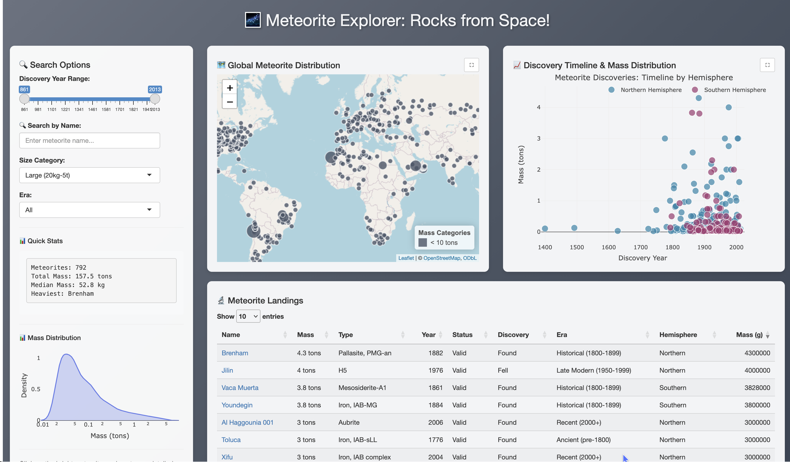

# Meteorite Explorer

An interactive R Shiny application for exploring meteorite landings data from NASA. Visualize the global distribution of meteorite discoveries and patterns over time from as early as 861 ([Nogata](https://www.lpi.usra.edu/meteor/metbull.php?code=16988))!



[Live on Posit Connect Cloud!](https://doodles-rocks-from-space.share.connect.posit.cloud)

## Posit Connect Cloud Architectural Changes
### Mapping Engine Redesign

**From**: Vector tiles + custom HTTP server + complex coordinate transformations
**To**: Direct sf object rendering + circle layers + simplified coordinate handling
**Result**: ~500 lines of tile server code removed, zero external dependencies

### Database Connection Architecture

Implemented auto-reconnecting database layer via,

```{r}
ensure_connection <- function() {
  if (is.null(con) || !dbIsValid(con)) {
    con <<- dbConnect(duckdb(), DB_PATH, read_only = TRUE) # global assignment hack tbh
  }
  return(con)
}
```

This handles:

* User sessions timing out  
* Platform connection recycling  
* Network hiccups  
* Database restarts  
* Concurrent user access  

## App Features

-   **Interactive Global Map**: View 32,050 meteorite landing locations worldwide with size-based markers and color-coded mass categories
-   **Easy Filtering**: Filter by discovery era (including unknown!), meteorite name, and size 
-   **Quick Stats**: Get numbers on filtered data including total mass, median mass, and heaviest meteorite
-   **Responsive Design**: Clean, modern interface optimized for data exploration

## Data Sources

This application uses meteorite landing data from:

\- **NASA Meteorite Landings Dataset (json)**: <https://data.nasa.gov/dataset/meteorite-landings>

\- Links to detailed information from the **Meteoritical Bulletin Database** maintained by the Lunar and Planetary Institute <https://meteoritical.org/>

## Tech Stack

-   **R Shiny**: Web application framework
-   **DuckDB**: High-performance analytical database for data processing
-   **mapgl**: Interactive mapping
-   **Plotly**: Interactive visualizations
-   **DataTables**: Enhanced table display with search and sorting
-   **bslib**: Modern UI components and theming

## Dependencies

-   R (version 4.0 or higher)
-   Required R packages (see renv)

## Project Structure

```
Shiny implementation          # R Shiny 
│   └── app.R
├── R/                        # DuckDB via R client
├── download_meteorites.R     # Download data from NASA portal
├── build_indexed_db.R        # Build indexed DuckDB database
└── README.md
```

## 🔧 Getting Setup

### 1. Install R package dependencies
```r
install.packages(c(
  "arrow",     "here",      "shiny",     "bslib",     "mapgl",     "dplyr",     "stringr",   "plotly",    "duckdb",    "DBI",       "DT",        "sf"       ))
```

Or use *renv*

```r
renv::restore()
```

### 2. Download Data
```bash
cd R
Rscript ./download_meteorites.R
Rscript ./build_indexed_db.R
```

### 3. Run Shiny App

```r
shiny::runApp("Shiny")
```

## Multi-Stage ETL with DuckDB

Stage 1: NASA API Data Extraction (download_meteorites.R)

Extract and clean raw meteorite data from NASA's Open Data Portal:

- Direct API Integration: Queries NASA's JSON API using DuckDB's read_json_auto() function  
- Complex JSON Parsing: Unnests nested arrays and maps 20+ data fields from NASA's schema  
- Real-time Processing: Transforms data during download (field mapping, type conversion, URL generation)  
- Data Validation: Filters out records with missing coordinates or mass data  
- Efficient Storage: Saves to compressed Parquet format with ZSTD compression  

**Output**: meteorites.parquet (~32k meteorites, optimized for analytics)

Stage 2: Database Optimization (build_spatial_db.R)

Transform flat data into optimized DuckDB database with computed fields and indexes:

- Pre-computed Categories: Generates size categories and historical eras during build process  
- Data Quality Fixes: Corrects known data anomalies (e.g., meteorite #57150 year correction)  
- Unit Conversions: Converts grams to kg/tons for easier visualization  
- Standardized Coordinates: Ensures lat/lon are in decimal degrees for direct map rendering  

**Output**: meteorites.duckdb 

Stage 3: Production Application

Serve interactive queries against the optimized database:

- Sub-second Queries: Direct coordinate-based filtering across 32k records  
- Zero Computation: Pre-computed categories eliminate runtime calculations  
- Direct Map Rendering: Lat/lon coordinates ready for immediate mapGL visualization  
- Auto-healing Connections: Production-grade connection management for cloud deployment  

**Pipeline Benefits**

| Stage    | Processing Time | Output Size    | Key Optimization            |
|----------|-----------------|----------------|------------------------------|
| Download | 5-10 minutes    | ~0.8MB Parquet | Compressed parquet file      |
| Build    | <1 second       | ~3.5MB DuckDB  | Pre-computed aggregations    |
| Runtime  | <1 second       | Interactive    | Direct coordinate rendering  |

Total Build Time: ~5-10 minutes
Runtime Performance: Sub-second response for any filter combination!

The app renders meteorites directly as map markers using their lat/lon coordinates without requiring spatial query operations.

## References

- [Josiah Parry - {duckdb} or {dbplyr}](https://josiahparry.com/posts/2024-05-24-duckdb-and-r)  
- [Dario Radečić - R Shiny and DuckDB: How to Speed Up Your Shiny Apps When Working With Large Datasets](https://www.appsilon.com/post/r-shiny-duckd)  
- [Sara Altman - Creating a Shiny app that interacts with a database ](https://posit.co/blog/shiny-with-databases/)  
- [Federico Tallis - Visualizing Millions of Buildings with duckdb](https://medium.com/@federico.tallis/visualizing-millions-of-buildings-with-duckdb-st-asmvt-a-streamlit-vs-shiny-comparison-5a4c924fe067)  

## Acknowledgments

- [Meteoritical Society](https://meteoritical.org/) - official meteorite database  
- [NASA Open Data](https://www.nasa.gov/) - meteorite landings dataset  
- [Shiny Assistant](https://gallery.shinyapps.io/assistant/#) - Shiny app building, tweaks, and troubleshooting!  
- [DuckDB](https://duckdb.org/) - Python has more support, but the R API works well enough!